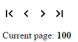

# vellum-pager

A pagination control.

### [Demo](https://vellum-pager.polymer.zikes.me/demo/)

## Simple Example

```
<vellum-pager pages="50"></vellum-pager>
```


## Custom Distance

```
<vellum-pager distance="5" pages="100"></vellum-pager>
```


## Bound Page

```
<template is="dom-bind">
  <vellum-pager pages="100" page="{{page}}"></vellum-pager>
  <p>Current page: <strong>{{page}}</strong></p>
</template>
```


## Arrows

```
<template is="dom-bind">
  <vellum-pager just-arrows pages="100" page="{{page}}"></vellum-pager>
  <p>Current page: <strong>{{page}}</strong></p>
</template>
```


